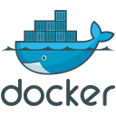
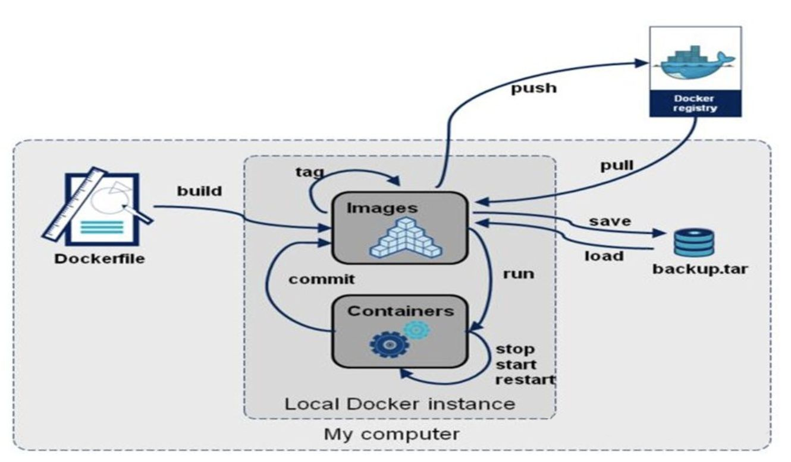
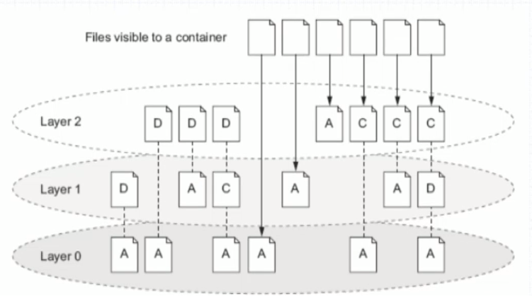
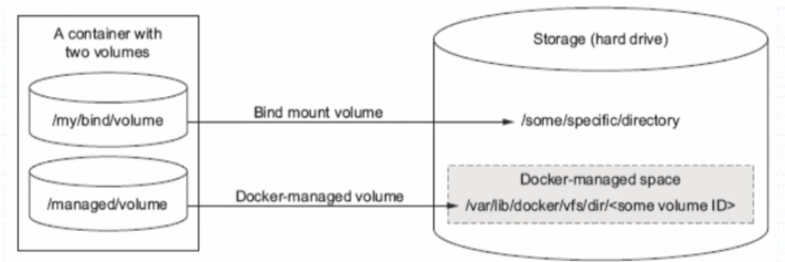
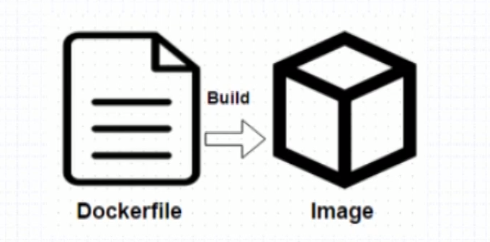

[](https://docs.docker.com/)

[](https://www.docker.com/)

## 主机级虚拟化

[Type1和Type2虚拟机管理程序区别](https://virtual.51cto.com/art/201904/594481.htm)

### Type1

```bash
Type1虚拟机管理程序直接在主机的物理硬件上运行 它被称为裸机虚拟机管理程序
它不必预先加载底层操作系统 通过直接访问底层硬件而无需其他软件(例如操作系统和设备驱动程序)
```

- VMware ESXi
- Microsoft Hyper-V服务器
- 开源KVM
- ...

### Type2

```bash
Type2虚拟机管理程序通常安装在现有操作系统之上 它称为托管虚拟机管理程序
因为它依赖于主机预先安装的操作系统来管理对CPU/内存/存储和网络资源的调用
```

- VMware Fusion
- Oracle VM VirtualBox
- 用于x86的Oracle VM Server
- Oracle Solaris Zones
- Parallels
- VMware Workstation
- ...

## 容器级虚拟化

### Namespace

[man-namespaces](https://man7.org/linux/man-pages/man7/namespaces.7.html)

[namespaces API](https://lwn.net/Articles/531381/)

```bash
clone()   # Creating a child in a new namespace

setns()   # Joining an existing namespace

unshare() # Leaving a namespace
```

Linux Namespaces
| namespace | 系统调用参数 | 隔离内容 | 内核版本 |
| -----| ---- | ---- | ---- |
| UTS | CLONE_NEWUTS | 主机名和域名 | 2.6.19 |
| IPC | CLONE_NEWIPC | 信号量/消息队列/共享内存 | 2.6.19 |
| PID | CLONE_NEWPID | 进程编号 | 2.6.24 |
| Network | CLONE_NEWNET | 网络设备/网络栈/端口等 | 2.6.29 |
| Mount | CLONE_NEWNS | 挂载点(文件系统) | 2.4.19 |
| User | CLONE_NEWUSER | 用户和用户组 | 3.8 |

### Control Groups

[man-cgroups](https://man7.org/linux/man-pages/man7/cgroups.7.html)

[linux资源管理之cgroups简介](https://tech.meituan.com/2015/03/31/cgroups.html)

```bash
cgroups是Linux内核提供的一种可以限制单个进程或者多个进程所使用资源的机制 可以对cpu/内存等资源实现精细化的控制

cgroups 的全称是control groups 
cgroups为每种可以控制的资源定义了一个子系统 典型的子系统介绍如下
```

- blkio 块设备IO
- cpu CPU
- cpuacct CPU资源使用报告
- cpuset 多处理器平台上的CPU集合(按核/按比例)
- devices 设备访问
- freezer 挂起或恢复任务
- memory 内存用量及报告
- perf_event 对cgroup中的任务进行统一性能测试
- net_cls cgroup中的任务创建的数据报文的类别标识符

### LXC

[whats-a-linux-container](https://www.redhat.com/zh/topics/containers/whats-a-linux-container)

- LinuX Container
  - lxc-create(创建namespace)
  - template(拉取所需发行版的仓库相关包进行安装)

### 容器编排

- machine + swarm + docker compose(单机编排)
- mesos + marathon
- kubernetes(k8s)

## Docker

```bash
# docker 容器引擎的发展
# LXC -> libcontainer -> runC
-> libcontainer(docker研发的容器引擎 替换LXC) 
-> runC(容器运行时环境标准 Docker将RunC捐赠给OCI作为OCI容器运行时标准的参考实现)
```

[docker/containerd/runC分别是什么](https://os.51cto.com/art/202110/687502.htm)

### OCI

[](https://opencontainers.org/)

Open Container Initiative

- 由Linux基金会主导于2015年6月创立
- 旨在围绕容器格式和运行时制定一个开放的工业化标准
- contains two specifications
  - the Runtime Specification (runtime-spec) 运行时标准(规范)
  - the Image Specification (image-spec) 镜像格式标准(规范)
- The Runtime Specification outlines how to run a "filesystem bundle" that is unpacked on disk
- At a high-level an OCI implementation would download an OCI Image then unpack that image into an OCI Runtime filesystem bundle

### runC

[runC](https://github.com/opencontainers/runc)

- OCF: Open Container Format
- runC: runc is a CLI tool for spawning and running containers on Linux according to the OCI specification

### docker architecture

[](https://docs.docker.com/get-started/overview/#docker-architecture)

```bash
Client -> Daemon(REST API, over UNIX sockets or a network interface)
Registry -> Host(https/http)

Registry: 仓库名(repo name) + 标签(tag) 唯一标识一个镜像
-> nginx:1.14.0
-> nginx:latest(default 最新版)

Images: An image is a read-only template with instructions for creating a Docker container
Images：静态的 不会运行
Containers：动态 有生命周期 类似命令
  /bin/ls
    - ls /etc
    - ls /var

Moby
docker-ee # 企业版
docker-ce # 社区版
```

### docker objects

[docker objects](https://docs.docker.com/get-started/overview/#docker-objects)

- images
- containers
- networks
- volumes
- plugins
- other objects

#### Images

- An image is a read-only template with instructions for creating a Docker container
- Often, an image is based on another image, with some additional customization
- You might create your own images or you might only use those created by others and published in a registry

#### Containers

- A container is a runnable instance of an image
- You can create/start/stop/move or delete a container using the Docker API or CLI
- You can connect a container to one or more networks, attach storage to it, or even create a new image based on its current state

### docker install

[Install Docker Engine](https://docs.docker.com/engine/install/)

[阿里云Mirrors docker-ce](https://mirrors.aliyun.com/docker-ce/)

#### docker-ce.repo

```bash
[docker-ce-stable]
name=Docker CE Stable - $basearch
baseurl=https://download.docker.com/linux/centos/$releasever/$basearch/stable
# baseurl=https://mirrors.aliyun.com/docker-ce/linux/centos/$releasever/$basearch/stable
enabled=1
gpgcheck=1
gpgkey=https://download.docker.com/linux/centos/gpg
```

#### 镜像加速

- docker cn
- [阿里云官方镜像加速](https://help.aliyun.com/document_detail/60750.html)
- 中国科技大学

```bash
# 配置文件
/etc/docker/daemon.json

# 更换镜像下载仓库链接
{
    "registry-mirrors": ["系统分配前缀.mirror.aliyuncs.com "]
}
```

### docker cli

[docekr-reference](https://docs.docker.com/reference/)

```bash
docker --help

# docker event state 涉及部分常用命令
```

### docker event state

[](https://docs.docker.com/engine/reference/commandline/events/)

### docker image

```bash
Docker镜像含有启动容器所需的文件系统及其内容 因此 其用于创建并启动docker容器
```

#### docker image layer


- 采用分层构建机制 最底层为bootfs 其它为rootfs
  - bootfs: 用于`系统引导`的文件系统 包括`bootloader`和`kernel` 容器启动完成后会被卸载以节约内存资源
  - rootfs: 位于bootfs之上 表现为docker容器的根文件系统
    - 传统模式中 系统启动时 内核挂载rootfs时会首先将其挂载为`只读`模式(自检) 完整性自检完成后将其重新挂载为读写模式
    - docker中 rootfs由内核挂载为`只读`模式 而后通过`联合挂载`技术额外挂载一个`可写`层
- docker image layer
  - 位与下层的镜像成为父镜像(parent image) 最底层的称为基础镜像(base image)
  - 最上层的为`可读写`层 其下的均为`只读`层


#### aufs

- Advanced Mult-Layered Unification Filesystem 高级多层统一文件系统
- 用于为Linux文件系统实现`联合挂载`
- aufs是之前UnionFS的重新实现 2006年由Junjiro Okajima开发
- Docekr最初使用aufs作为容器文件系统层 它目前仍作为存储后端之一来支持
- aufs的竞争产品是overlayfs 后者自从3.18版本开始被合并到Linux内核
- docker的分层镜像 除aufs之外 docker还支持btrfs/devicemapper/vfs等
  - Ubuntu系统下 docekr默认Ubuntu的aufs 而在CentOS7上 用的是devicemapper(新版默认使用overlay2)

#### docekr registry

```bash
启动容器时 docker daemon 会试图从本地获取相关的镜像 本地镜像不存在时 其将从Registry中下载该镜像并保存到本地
```

- Registry用于保存docker镜像 包括镜像的层次结构和元数据
- 用户可以自建Registry 也可以使用官方的Docker Hub
- 分类
  - Sponsor Registry: 第三方的registry 供客户和Docker社区使用(捐赠者)
  - Mirror Registry: 第三方的registry 只让客户使用(云)
  - Vendor Registry: 由发布Docker镜像的供应商提供的registry(redhat)
  - Private Registry: 通过设有防火墙和额外安全层的私有实体提供的registry(自建)
    - [docker-registry/docker-distribution](https://hub.docker.com/_/registry)
    - [harbor](https://goharbor.io/)


#### registry(repository and index)

- Repository
  - 由某特定的docker镜像的`所有迭代版本`组成的镜像仓库
  - 一个Registry中可以存在多个Repository
    - Repository可分为`顶层仓库`和`用户仓库`
    - 用户仓库名称格式为`用户名/仓库名` => `ilolicon/nginx`
  - 每个仓库可以包含多个Tag(标签) 每个标签对应一个镜像
- Index
  - 维护用户账户/镜像的校验以及公共命名空间的信息
  - 相当于为Registry提供一个完成用户认证等功能的检索接口
  
#### docker hub

[DockerHub](https://docs.docker.com/docker-hub/)

Docker Hub provides the following major features:

- [Repositories](https://docs.docker.com/docker-hub/repos/): Push and pull container images
- [Teams & Organizations](https://docs.docker.com/docker-hub/orgs/): Manage access to private repositories of container images
- [Docker Official Images](https://docs.docker.com/docker-hub/official_images/): Pull and use high-quality container images provided by Docker
- [Docker Verified Publisher Images](https://docs.docker.com/docker-hub/publish/): Pull and use high- quality container images provided by external vendors
- [Builds](https://docs.docker.com/docker-hub/builds/): Automatically build container images from GitHub and Bitbucket and push them to Docker Hub
- [Webhooks](https://docs.docker.com/docker-hub/webhooks/): Trigger actions after a successful push to a repository to integrate Docker Hub with other services

#### docker pull

[pull-commandline](https://docs.docker.com/engine/reference/commandline/pull/)

[quay.io](https://quay.io/)

```bash
$ docker pull <registry>[:port]/[<namespace>/]<name>:<tag>

# e.g:
# registry: quay.io
# port: 443(没指定 默认)
# namespace: coreos
# name: flannel(repostory名称)
# tag: v0.15.1-arm64 指定版本
$ docker pull quay.io/coreos/flannel:v0.15.1-arm64
```

| Namespace | Examples(<namespace/name>) |
|-----|-----|
| organization | redhat/kubernetes google/kubernetes |
| login(user name) | alice/application ilolicon/application |
| role | devel/database test/database prod/database |

#### 镜像的相关操作



- 镜像的生成途径
  - [Dockerfile](https://docs.docker.com/engine/reference/builder/)
  - [基于容器制作](https://docs.docker.com/engine/reference/commandline/commit/)
  - Docekr Hub automated builds(仍是基于Dockerfile)

- 另一种镜像分发方式
  - [docker-save](https://docs.docker.com/engine/reference/commandline/save/)
  - [docker-load](https://docs.docker.com/engine/reference/commandline/load/)

### 容器虚拟化网络

#### 容器虚拟化网络概述

[容器虚拟化网络](https://www.cnblogs.com/hukey/p/14062579.html)

```bash
OVS: Open VSwitch
SDN
Overlay Network(叠加网络)

# docker默认的三种网络
[ilolicon@master ~]$ docker network ls
NETWORK ID     NAME      DRIVER    SCOPE
78fa953ed316   bridge    bridge    local # 桥接 默认NAT桥
8ec55273feb2   host      host      local # 让容器直接使用宿主机的网络名称空间
9081fe29a218   none      null      local # 只有lo接口 没有其他网卡

[ilolicon@master ~]$ yum -y install bridge-utils
[ilolicon@master ~]$ brctl show
```


[docker-docs:network overview](https://docs.docker.com/network/)

- Closed Container
- Bridged Container(NAT桥接网络 默认)
- Joined Container(联盟式容器网络 相对隔离 只是共享同一个网络名称空间)
- Open Container(开放式容器网络 共享宿主机网络名称空间)

#### Bridged Containers

```bash
# Bridged Containers可以为docker run命令使用
# "--hostname HOSTNAME" 选项为容器指定主机名
$ docker run --rm --net bridge --hostname cloudnative.ilolicon.com busybox:latest hostname

# "--dns DNS_SERVER_IP" 选项能够为容器指定所使用的dns服务器地址
$ docker run --rm --dns 8.8.8.8 --dns 8.8.4.4 busybox:latest nslookup docker.com

# "--add-host HOSTNAME:IP" 选项能够为容器指定本地主机名解析项
$ docker run --rm --dns 172.16.0.1 --add-host "docker.com:172.16.0.100" busybox:latest cat /etc/hosts
```

##### Opening Inbound Communication / Expose

```bash
-p选项的使用格式

# 将指定的容器端口<containerPort> 映射至主机所有地址的一个动态端口
-p <containerPort>

# 将指定的容器端口<containerPort> 映射至指定的主机端口<hostPort>
-p <hostPort>:<containerPort>

# 将指定的容器端口<containerPort> 映射至主机指定<ip>的动态端口
-p <ip>::<containerPort>

# 将指定的容器端口<containerPort> 映射至主机指定<ip>的端口<hostPort>
-p <ip>:<hostPort>:<containerPort>

"动态端口" 指随机端口 具体的映射结果可使用docker port命令查看

Expose端口 还可以参考 -P 选项：暴露容器内部已指定的端口
```

#### Joined Container

- 联盟式容器是指使用某个已存在容器的网络接口的容器 接口被联盟内的各容器共享使用(NTS Network IPC)
- 联盟式容器彼此间虽然共享同一个网络名称空间 但其它内部名称空间如: User/Mount等还是隔离的
- 联盟式容器彼此间存在端口冲突的可能性 使用此种模式的网络模型情况
  - 多个容器上的程序需要程序loopback接口互相通信
  - 对某已存的容器的网络属性进行监控

```bash
# 创建一个监听于2222端口的http服务容器
$ docker run --name t1 -it --rm busybox
/ # ifconfig

# 创建一个联盟式容器(--network指定使用t1的网络名称空间) 并查看其监听的端口
$ docker run --name t2 -it --rm --network container:t1 busybox
/ # ifconfig
```

#### Open Container

```bash
# --network 指定 host
# 直接使用宿主机的网络名称空间 无需再Expose端口
$ docker run --rm -it --network host busybox
```

#### Closed Container

```bash
# --network none
$ docker run --rm -it --network none busybox
```

#### 自定义docker0桥的网络信息

```bash
# 编辑 /etc/docker/daemon.json 配置文件

{
    "bip": "192.168.1.5/24",
    "fixed-cidr": "10.20.0.0/16",
    "fixed-cidr-v6": "2001:db8::/64",
    "mtu": "1500",
    "default-gateway": "10.20.1.1",
    "default-gateway-v6": "2001:db8:abcd::89",
    "dns": ["10.20.1.2","10.20.1.3"]
}

# 核心选项为bip 即bridge ip之意 
# 用于指定docker0桥自身的IP地址 其他选项可以通过此地址计算得出
```

#### 使用TCP套接字

```bash
# dockerd守护进程的C/S 其默认仅监听Unix Socket格式的地址 /var/run/docker.sock
# 如果使用TCP套接字 需要修改 /etc/docekr/daemon.json 配置文件
# 也可向dockerd直接传递 "-H|--host"选项

{
    "hosts": ["tcp://0.0.0.0:2375", "unix:///var/run/docker.sock"]
}
```

```bash
# dockerd使用TCP监听0.0.0.0:2375之后 客户端可以远程执行CLI
$ docker -H x.x.x.x:2375 image ls
$ docker -H x.x.x.x:2375 ps -a
```

#### 创建自定义网络

```bash
# 创建自定义网络
$ docker network create -d bridge --subnet "172.26.0.0/16" --gateway "172.26.0.1" mybr0

# 使用自定义网络
[ilolicon@master ~]$ docker run -it --rm --name t1 --network mybr0 busybox
/ # ifconfig
eth0      Link encap:Ethernet  HWaddr 02:42:AC:1A:00:02  
          inet addr:172.26.0.2  Bcast:172.26.255.255  Mask:255.255.0.0
```

### docker存储卷

#### Why Data Volumes(存储卷)

```bash
Docker镜像由多个"只读层"叠加而成 
启动容器时 Docker会加载只读镜像层并在镜像栈顶部添加一个"读写层"

如果运行中的容器修改了现有的一个已经存在的文件
那该文件将会从读写层下面的只读层复制到读写层 该文件的只读版本"仍然存在"
只是已经被读写层中该文件的副本所隐藏 此即"写时复制(COW)"机制
```



- 关闭并重启容器 其数据不受影响 但删除Docker容器 则其更改将会全部丢失
- 存在的问题
  - 存储于联合文件系统中 不易于宿主机访问(效率低)
  - 容器间数据共享不便
  - 删除容器其数据会丢失
- 解决方案: "**卷**(volume)"
  - **卷**是容器上的一个或多个**目录** 此类目录可绕过联合文件系统 与宿主机上的某目录**绑定(关联)**
  - Volume于容器初始化之时即会创建 由base image提供的卷中的数据会于此期间完成复制
  - Volume的初衷是独立于容器的生命周期实现数据持久化 因此删除容器之时既不会删除卷 也不会对哪怕未被引用的卷做垃圾回收操作(加选项可以)


- 卷为docker提供了独立于容器的数据管理机制
  - 可以把**镜像**想象成静态文件 -> 例如 **程序**; 把卷类比为动态内容 -> 例如 **数据**; 于是 镜像可以重用 而卷可以共享
  - 卷实现了**程序(镜像)** 和 **数据(卷)** 分离 以及 **程序(镜像)** 和 **制作镜像的主机** 分离; 用户制作镜像时无需再考虑镜像运行的容器所在的主机的环境


#### Data volumes

```bash
Docekr有两种类型的卷 每种类型都在容器中存在一个挂载点 但在其宿主机上的位置有所不同
```

- Bind mount volume(绑定挂在卷)
  - a volume that points to a user-specified location on the host file system
- Docker-managed volume(Docker管理卷)
  - the Docker daemon creates managed volumes in a portion of the host's file system that's owned by Docker



```bash
# 在容器中使用Volumes
# 为docker run命令使用-v选项即可使用Volume

# Docker-managed volume
$ docker run -it --name t1 -v /data busybox
$ docker inspect -f {{.Mounts}} t1

# Bind-mount Volume
$ docker run -it -v HOSTDIR:VOLUMEDIR --name t2 bustbox
$ docker inspect -f {{.Mount}} t2
```

#### Sharing volumes

```bash
# There are tow ways to share volumes between containers

# 多个容器的卷使用同一个主机目录
$ docker run -it --name t1 -v /docker/volumes/v1:/data busybox
$ docker run -it --name t2 -v /docker/volumes/v1:/data busybox

# 复制使用其他容器的卷 为docker run命令使用 --volumes-from 选项
$ docker run -it --name t3 -v /docker/volumes/v1:/data busybox
$ docker run -it --name t4 --volumes-from t3 busybox

# 如果有多个容器需要共享网络名称空间(UTS Network IPC) 以及需要共享存储卷
# 可以 事先创建一个 基础容器 其他的容器都加入该容器的网络名称空间(Joined Container) 并且复制该容器使用的卷(--volumes-from)
$ docker run --name infracon -it -v /data/infracon/volume:/data busybox
$ docker run --name nginx --network container:infracon --volumes-from infracon -it nginx
$ docker run ... --network container:infracon --volumes-from infracon ...
```

## Dockerfile

[Dockerfile-reference](https://docs.docker.com/engine/reference/builder/)

Dockerfile is nothing but the source code for building Docker images

- Docker can build images automatically by reading the instructions from a Dockerfile
- A Dockerfile is a `text document` than contains all the commands a user could call on the command line to assemble an image
- Using `docker build` users can create an automated build that executes several command-line instructions in succession



### Dockerfile Format

- Format
  - \# Comment (注释)
  - INSTRUCTION arguments (指令及其参数 通常一行一个执行 太长使用`\`换行)
- The instruction is not case-sensitive (指令大小写不敏感)
  - However, convention is for them to be UPPERCASE to distinguish them from arguments more easily (一般约定使用大写 和参数区分开)
- Docker runs instructions in a Dockerfile in order (顺序执行)
- The first instruction must be `FROM` in order to specify the Base Image from which you are building (第一个非指数行 必须为`FROM`指令)

### .dockerignore file

- Before the docker CLI sends the context to the docker daemon, it looks for a file named .dockerignore in the root directory of the context
- If this file exists, the CLI modifies the context to exclude files and directories than match patterns in it
- The CLI interprets the .dockerignore file as a newline-separated list of patterns similar to the file globs of Unix shells

### Environment replacement

- Environment variables (declared with the `ENV` statement) can also be used in certain instructions as variables to be interpred by the Dockerfile
- Environment variables are notated in the Dockerfile either with $variable_name or ${variable_name}
- The ${variable_name} syntax also supports a few of the standard bash modifiers
  - ${variable:-word} - 设置默认值 variable未设置或为空 则变量默认值为: word
  - ${variable:+word} - 和 ${variable:-word} 相反

### Docekrfile Instructions

#### FROM

- `FROM`指令是最重要的一个且必须为Docekrfile文件开篇的第一个非注释行 用于为镜像文件构建过程指定基准镜像 后续的指令运行于此基准镜像所提供的运行环境
- 实践中 基准镜像可以是任何可用镜像文件 默认情况下 `docekr build`会在docker主机上查找指定的镜像文件 在其不存在时 则会从Docker Hub Registry上拉取所需的镜像文件
  - 如果找不到执行的镜像文件 `docker build`会返回一个错误信息
- Syntax
  - `FROM <repository>[:<tag>]` 或
  - `FROM <repository>@<digest>` @符号指定hash码 确保base image不会被篡改
    - `<repository>` 指定作为 base image 的名称
    - `<tag>` base image 的标签 可选 省略时默认为latest

#### MAINTANIER(deprecated)

- 用于让Docekrfile制作者提供本人的详细信息
- Dockerfile并不限制MAINTANIER指令出现的位置 但推荐将其放置于`FROM`指令后
- Syntax
  - `MAINTANIER <author's detail>`
    - `<author's detail>`可以是任何文本信息 但约定俗成地使用作者名称及其邮件地址
    - `MAINTANIER "ilolicon <97431110@qq.com>"`

#### LABEL

The LABEL instruction adds metadata to an image (可替换MAINTANIER 并可添加更多元数据信息)

- Syntax: `LABEL <key>=<value> <key>=<value> <key>=<value> ...`
- The LABEL instruction adds metadata to an image
- A LABEL is a key-value pair
- To include spaces within a LABEL value, use quotes and backslashes as you would in command-line parsing
- An image can have more than one label
- You can specify multiple labels on a single line

#### COPY

- 用于从Docker主机复制文件至创建的新镜像文件
- Syntax
  - `COPY <src> ... <dest>` 或
  - `COPY ["<src>", ..., "<dest>"]`
    - `<src>` 要复制的源文件或目录 支持使用通配符
    - `<dest>` 目标路径 即正在创建的image的文件系统路径 建议`<dest>`使用绝对路径 否则`COPY`指令则以WORKDIR为其起始路径
  - 注意: 在路径中有空白符时 通常使用第二种格式
- 文件复制准则
  - `<src>`必须是build上下文中的路径 不能是其父目录中的文件
  - 如果`<src>`是目录 则其内部文件或子目录会被递归复制 但是`<src>`目录本身不会被复制
  - 如果指定多个`<src>` 或在`<src>`中使用了通配符 则`<dest>`必须是一个目录 且必须以`/`结尾
  - 如果`<dest>`事先不存在 它将会被自动创建 这包括其父级目录

#### ADD

- `ADD`指令类似于`COPY`指令 ADD支持使用TAR文件和URL路径
- Syntax
  - `ADD <src> ... <dest>` 或
  - `ADD ["<src>", ..., "<dest>"]`
- 操作准则
  - 同`COPY`指令
  - URL
    - 如果`<src>`为URL且`<dest>`不以`/`结尾 则`<src>`指定的文件将被下载并直接被创建为`<dest>`
    - 如果`<src>`为URL且`<dest>`以`/`结尾 则文件名URL指定的文件将被下载并保存为`<dest>/<filename>`
  - TAR
    - 如果`<src>`是一个本地系统上的压缩格式的tar文件 它将被展开为一个目录 其行为类似于`tar -x`命令 然而 通道URL获取到的tar文件将不会自动展开
  - 如果`<src>`有多个 或其间接或直接使用了通配符 则`<dest>`必须是一个以`/`结尾的目录路径 如果`<dest>`不以`/`结尾 则其将被视为一个普通文件 `<src>`的内容将被直接写入到`<dest>`

#### WORKDIR

- 用于为Dockerfile中所有的`RUN/CMD/ENTRYPOINT/COPY/ADD`指令设置工作目录
- Syntax
  - `WORKDIR <dirpath>`
    - 在Dockerfile中 `WORKDIR`指令可以出现多次 其路径也可以为相对路径 不过其是相对此前一个`WODKDIR`指令指定的路径
    - 另外 `WORKDIR`也可调用由`ENV`指令定义的变量
  - e.g
    - `WORKDIR /var/log`
    - `WORKDIR $STATEPATH`

#### VOLUME

- 用于在image中创建一个挂载点目录 以挂载Docker host上的卷或其他容器上的卷
- Syntax
  - `VOLUME <mountpoint>` 或
  - `VOLUME ["<mountpoint>"]`
- 如果挂载点目录路径下此前在文件存在 `docker run`命令会在挂载完成后将此前的所有文件复制到新挂载的卷中

#### EXPOSE

- 用于为容器打开指定要监听的端口 以实现与外部通信
- Syntax
  - `EXPOSE <port>[/<protocol>] [<port>[/protocol]...]`
    - `<protocol>`用于指定传输层协议 可为tcp或udp二者之一 默认为TCP协议
  - `EXPOSE`指令可一次指定多个端口
    - `EXPOSE 11211/udp 11211/tcp`

#### ENV

- 用于为镜像定义所需的环境变量 并可被Dockerfile文件中位与其后的其它指令(如`ENV/ADD/COPY`等)所调用
- 调用格式为 $variable_name 或 ${variable_name}
- Syntax
  - `ENV <key> <value>` 或
  - `ENV <key>=<value> ...`
- 第一种格式中: `<key>`之后的所有内容均会被视作其`<value>`的组成部分 因此 一次只能设置一个变量
- 第二种格式中: 可以一次设置多个变量 每个变量为一个`<key>=<value>`的键值对 如果`<value>`中包含空格 可以以反斜线`\`进行转义 也可以通过对`<value>`加引号进行标识 另外 反斜线也用于续行
- 定义多个变量时 建议使用第二种方式 以便在同一层中完成所有功能

#### RUN

- 用于指定`docker build`过程中运行的程序 其可以是任何命令(基于base image提供)
- Syntax
  - `RUN <command>` 或
  - `RUN ["<executable>", "<param1>", "<param2>"]`
- 第一种格式中 `<command>` 通常是一个shell命令 且以`/bin/sh -c`来运行它 这意味着此进程在容器中的PID不是1 不能接收Unix信号 因此 当使用`docker stop <container>`命令停止容器时 此进程接收不到SIGTERM信号
- 第二种语法格式中的参数是一个JSON格式的数组 其中`<executable>`为要运行的命令 后面的`<paramN>`为传递给命令的选项或参数 然而 此种格式指定的命令不会以`/bin/sh -c`来发起 因此常见的shell操作如变量替换以及通配符`? *等`替换将不会进行 不过如果要运行的命令依赖于此shell特性的话 可以将其替换为类似下面的格式
  - `RUN ["/bin/sh", "-c", "<executable>", "<param1>"]`
  - Json数组中 注意要使用**双引号**

#### CMD

- 类似于`RUN`指令 `CMD`指令也可用于运行任何命令或应用程序 不过 二者的运行时间点不同
  - `RUN`指令运行于映像文件构建过程中 而`CMD`指令运行于基于Dockerfile构建出的新映像文件启动一个容器时
  - `CMD`指令的首要目的在于为启动的容器指定`默认`要运行的程序 且其运行结束后 容器也将终止 不过`CMD`指定的命令可以被`docker run`的命令行选项所覆盖
  - 在Docekrfile中 可以存在多个`CMD`指令 但仅最后一个会生效
- Syntax
  - `CMD <command>` 或
  - `CMD ["<executable>", "<param1>", "<param2>"]` 或
  - `CMD ["<param1>", "<param2>"]`
- 前两种语法格式的意义同`RUN`
- 都三种则用于为`ENTRYPOINT`指令提供默认参数

#### ENTRYPOINT

- 类似`CMD`指令的功能 用于为容器指定默认运行程序 从而使得容器像是一个单独的可执行程序
- 与`CMD`不同的是 由`ENTRYPOINT`启动的程序不会被`docker run`命令行指定的参数所覆盖 而且 这些命令行参数会被当作参数传递给`ENTRYPOINT`指令指定的程序
  - 不过 `docker run`命令的`--entrypoint`选项的参数 可以覆盖`ENTRYPOINT`指令指定的程序
- Syntax
  - `ENTRYPOINT <command>`
  - `ENTRYPOINT ["<executable>", "<param1>", "<param2>"]`
- `docker run`命令传入的命令参数会覆盖`CMD`指令的内容 并且附加到`ENTRYPOINT`命令最后作为其参数使用
- Dockerfile文件中也可以存在多个`ENTRYPOINT`指令 但仅有最后一个会生效

Tips: 使用`ENTRYPOINT`解决配置文件**环境变量**使用问题

```bash
# 问题: nginx(或其他程序)配置文件有许多需要修改的配置
# 比如: root_dir / listen_ip / listen_port 等等 
# 使用容器的情况下 如何更优的解决该问题?
```

- docker-entrypoint.sh

[refer:MySQL dokcer-entrypoint.sh](https://github.com/docker-library/mysql/blob/master/5.7/docker-entrypoint.sh)

```bash
#!/bin/sh

# 根据变量(环境变量/自定义变量)生成配置文件
# 需要修改的 传入环境变量的方式 比如: APP_ENV: TEST|PROD|DEV
# docker run -d --name=ngx --env PORT=8080 --env XX=XX --rm ngx:v1
IP=$(ip address show dev eth0 | awk '/inet /{split($2, ip, "/");print ip[1]}')

cat > /etc/nginx/conf.d/www.conf << EOF
server {
    server_name ${HOSTNAME};
    listen ${IP:-0.0.0.0}:${PORT:-80};
    root ${NGX_DOC_ROOT:-/usr/share/nginx/html/};
}

EOF

# Dockerfile CMD指定的参数($@) 取代当前shell 成为 main-process
exec "$@"
```

- Dockerfile

```Dockerfile
FROM nginx:1.14-alpine

LABEL maintainer="ilolicon <97431110@qq.com>"

ENV NGX_DOC_ROOT="/data/www/html/"

ADD index.html $NGX_DOC_ROOT
ADD docker-entrypoint.sh /bin/

CMD ["/usr/sbin/nginx", "-g", "daemon off"]

# CMD指令参数 传递给docker-entrypoint.sh脚本 脚本用$@获取全部参数
ENTRYPOINT ["/bin/docker-entrypoint.sh"]
```

#### USER

- 用于指定运行image时或运行Dockerfile中任何`RUN CMD 或 ENTRYPOINT`指令指定的程序时的用户名或UID
- 默认情况下 container的运行身份为root用户
- Syntax
  - `USER <UID>|<UserName>`
  - 需要注意的是 `<UID>`可以为任意数字 但实践中其必须为`/etc/passwd`(容器中)中某用户的有效UID 否则`docker run`命令将运行失败

#### HEALTHCHECK

[HEALTHCHECK](https://docs.docker.com/engine/reference/builder/#healthcheck)

- The `HEALTHCHECK` instruction tells Docker how to test a container to check that it is still working
- This can detect cases such as a web server that is stuck in an infinite loop and unable to handle new connections, even though the server process is still running
- The HEALTHCHECK instruction has two forms
  - `HEALTHCHECK [OPTIONS] CMD command` (check container health by running a command inside the container)
  - `HEALTHCHECK NONE` (disable any healthcheck inherited from the base image)
- The options that can appear before CMD are:
  - --interval=DURATION (default: 30s)
  - --timeout=DURATION (default: 30s)
  - --start-period=DURATION (default: 0s) - 多少秒之后开始检测 等待container init的时间
  - --retries=N (default: 3)
- The command’s exit status indicates the health status of the container. The possible values are:
  - 0: success - the container is healthy and ready for use
  - 1: unhealthy - the container is not working correctly
  - 2: reserved - do not use this exit code - 预留 不要使用
- For example
  - `HEALTHCHECK --interval=5m --timeout=3s CMD curl -f http://localhost/ || exit 1`

#### SHELL

[SHELL](https://docs.docker.com/engine/reference/builder/#shell)

- The `SHELL` instruction allows the default *shell* used for the shell form of commands to be overridden
- The default shell on Linux is ["/bin/sh", "-c"], and on Windows is ["cmd", "/S", "/C"]
- The `SHELL` instruction must be written in JSON form in a Dockerfile
  - Syntax: SHELL ["executable", "parameters"]
- The `SHELL` instruction can appear multiple times
- Each `SHELL` instruction overrides all previous `SHELL` instructions, and affects all subsequent instruction

#### STOPSIGNAL

[STOPSIGNAL](https://docs.docker.com/engine/reference/builder/#stopsignal)

- The `STOPSIGNAL` instruction sets the system call signal that will be sent to the container to exit
- This signal can be a signal name in the format `SIG<NAME>`, for instance `SIGKILL`, or an unsigned number that matches a position in the kernel’s syscall table, for instance `9`
  - The default is `SIGTERM` if not defined
- Syntax: `STOPSIGNAL signal`

#### ARG

[ARG](https://docs.docker.com/engine/reference/builder/#arg)

- The ARG instruction defines a variable that users can pass at build-time to the builder with the docker build command using the `--build-arg <varname>=<value>` flag
- If a user specifies a build argument that was not defined in the Dockerfile, the build outputs a warning
  - `[Warning] One or more build-args [foo] were not consumed.`
- Syntax: `ARG <name>[=<default value>]`
- A Dockerfile may include one or more `ARG` instructions
- An `ARG` instruction can optionally include a default value:
  - `ARG user1=someuser`
  - `ARG buildno=1`

⚠️ **Warning**
It is not recommended to use build-time variables for passing secrets like github keys, user credentials etc. Build-time variable values are visible to any user of the image with the `docker history` command.

Refer to the ["build images with BuildKit"](https://docs.docker.com/develop/develop-images/build_enhancements/#new-docker-build-secret-information) section to learn about secure ways to use secrets when building images.

#### ONBUILD

- 用于在Dockerfile中定义一个触发器
- Dockerfile用于build映像文件 此映像文件亦可作为base image被另一个Dockerfile用作`FROM`指令的参数 并以之构建新的镜像文件
- 在后面的这个Dockerfile中的`FROM`指令在build过程中被执行时 将会**触发**创建其base image的Dockerfile文件中的`ONBUILD`指令定义的触发器
- Syntax
  - `ONBUILD <INSTRUCTION>`
- 尽管任何指令都可以注册成为触发器指令 但`ONBUILD`不能自我嵌套 且不会触发`FROM`和`MAINTAINER`指令
- 使用包含`ONBUILD`指令的Dockerfile构建的镜像应该使用特殊的标签
  - e.g: ruby:2.0-onbuild
- 在`ONBUILD`指令中使用`ADD`或`COPY`指令应该格外小心 因为新 构建过程的上下文在缺少指定的源文件时会失败

## Docker资源限制

[Limit a container's resources](https://docs.docker.com/config/containers/resource_constraints/)

- By default, a container has no resource constraints and can use as much of a given resource as the host’s kernel scheduler allows
- Docker provides ways to control how much memory, or CPU a container can use, setting runtime configuration flags of the `docker run` command
- Many of these features require your kernel to support Linux capabilities
  - To check for support, you can use the `docker info` command

### OOME

- On Linux hosts, if the kernel detects that there is not enough memory to perform important system functions, it throws an `OOME`, or `Out Of Memory Exception`, and starts killing processes to free up memory
  - 一旦发生OOME 任何进程都有可能被杀死 包括docker daemon在内
  - 为此 Docker特地调整了docker daemon的OOM优先级 以免它被内核"正法" 但容器优先级并为调整
  - `Memory Hogs` `OOM_ADJ` `OOM_SCORE`

#### Limit a container’s access to memory

- Docker can enforce hard memory limits, which allow the container to use no more than a given amount of user or system memory
- or soft limits, which allow the container to use as much memory as it needs unless certain conditions are met, such as when the kernel detects low memory or contention on the host machine
- Some of these options have different effects when used alone or when more than one option is set
- Most of these options take a positive integer, followed by a suffix of `b, k, m, g`, to indicate bytes, kilobytes, megabytes, or gigabytes

| Option | Description |
| ----- | ----- |
| `-m` or `--memory=` | The maximum amount of memory the container can use. If you set this option, the minimum allowed value is `6m` (6 megabytes). That is, you must set the value to at least 6 megabytes. |
| `--memory-swap *` | The amount of memory this container is allowed to swap to disk. See [`--memory-swap` details](https://docs.docker.com/config/containers/resource_constraints/#--memory-swap-details). |
| `--memory-swappiness` | By default, the host kernel can swap out a percentage of anonymous pages used by a container. You can set `--memory-swappiness` to a value between 0 and 100, to tune this percentage. See [`--memory-swappiness` details](https://docs.docker.com/config/containers/resource_constraints/#--memory-swappiness-details). |
| `--memory-reservation` | Allows you to specify a soft limit smaller than `--memory` which is activated when Docker detects contention or low memory on the host machine. If you use `--memory-reservation`, it must be set lower than `--memory` for it to take precedence. Because it is a soft limit, it does not guarantee that the container doesn’t exceed the limit. |
| `--kernel-memory` | The maximum amount of kernel memory the container can use. The minimum allowed value is `4m`. Because kernel memory cannot be swapped out, a container which is starved of kernel memory may block host machine resources, which can have side effects on the host machine and on other containers. See [`--kernel-memory` details](https://docs.docker.com/config/containers/resource_constraints/#--kernel-memory-details). |
| `--oom-kill-disable` | By default, if an out-of-memory (OOM) error occurs, the kernel kills processes in a container. To change this behavior, use the `--oom-kill-disable` option. Only disable the OOM killer on containers where you have also set the `-m/--memory` option. If the `-m` flag is not set, the host can run out of memory and the kernel may need to kill the host system’s processes to free memory. |

#### --memory-swap

- Using swap allows the container to write excess memory requirements to disk when the container has exhausted all the RAM that is available to it
- `--memory-swap` is a modifier flag that only has meaning if `--memory` is also set

| `--memory-swap` | `--memory` | 功能 |
| ----- | ----- | ----- |
| 正数S | 正数M | 容器可用总空间为S 其中ram为M swap为(S-M) 若S=M 则无可用swap资源 |
| 0 | 正数M | 相当于未设置swap(unset) |
| unset | 正数M | 若主机(Docker Host)启用了swap 则容器的可用swap为 2*M |
| -1 | 正数M | 若主机(Docker Host)启用了swap 则容器可使用最大至主机的所有swap空间的swap资源 |

⚠️ **注意:** 在容器内使用free命令可以看到的swap空间 并不具有其所展示出的空间指示意义

### CPU

[深入Linux的进程优先级](https://linux.cn/article-7325-1.html)

- By default, each container’s access to the host machine’s CPU cycles is unlimited
- You can set various constraints to limit a given container’s access to the host machine’s CPU cycles
- Most users use and configure the [default CFS scheduler](https://docs.docker.com/config/containers/resource_constraints/#configure-the-default-cfs-scheduler)
- You can also configure the [realtime scheduler](https://docs.docker.com/config/containers/resource_constraints/#configure-the-realtime-scheduler).

#### Configure the default CFS scheduler

The CFS is the Linux kernel CPU scheduler for normal Linux processes. Several runtime flags allow you to configure the amount of access to CPU resources your container has. When you use these settings, Docker modifies the settings for the container’s cgroup on the host machine.

| Option | Description |
| ----- | ----- |
| `--cpus=<value>` | Specify how much of the available CPU resources a container can use. For instance, if the host machine has two CPUs and you set `--cpus="1.5"`, the container is guaranteed at most one and a half of the CPUs. This is the equivalent of setting `--cpu-period="100000"` and `--cpu-quota="150000"`. |
| `--cpu-period=<value>` | Specify the CPU CFS scheduler period, which is used alongside `--cpu-quota`. Defaults to 100000 microseconds (100 milliseconds). Most users do not change this from the default. For most use-cases, `--cpus` is a more convenient alternative. |
| `--cpu-quota=<value>` | Impose a CPU CFS quota on the container. The number of microseconds per `--cpu-period` that the container is limited to before throttled. As such acting as the effective ceiling. For most use-cases, `--cpus` is a more convenient alternative. |
| `--cpuset-cpus` | Limit the specific CPUs or cores a container can use. A comma-separated list or hyphen-separated range of CPUs a container can use, if you have more than one CPU. The first CPU is numbered 0. A valid value might be `0-3` (to use the first, second, third, and fourth CPU) or `1,3` (to use the second and fourth CPU). |
| `--cpu-shares` | Set this flag to a value greater or less than the default of 1024 to increase or reduce the container’s weight, and give it access to a greater or lesser proportion of the host machine’s CPU cycles. This is only enforced when CPU cycles are constrained. When plenty of CPU cycles are available, all containers use as much CPU as they need. In that way, this is a soft limit. `--cpu-shares` does not prevent containers from being scheduled in swarm mode. It prioritizes container CPU resources for the available CPU cycles. It does not guarantee or reserve any specific CPU access. |

```bash
# If you have 1 CPU, each of the following commands guarantees the container at most 50% of the CPU every second.
$ docker run -it --cpus=".5" ubuntu /bin/bash

# Which is the equivalent to manually specifying --cpu-period and --cpu-quota;
$ docker run -it --cpu-period=100000 --cpu-quota=50000 ubuntu /bin/bash
```

### 测试

[stress](https://hub.docker.com/r/polinux/stress)

```bash
# 使用stress镜像 进行测试
$ docker run -ti --rm polinux/stress stress --cpu 1 --io 1 --vm 1 --vm-bytes 128M --timeout 1s --verbose

# 显示容器的运行进程
$ docker top CONTAINER

# 显示容器资源使用统计的实时流
$ docker stats
```
